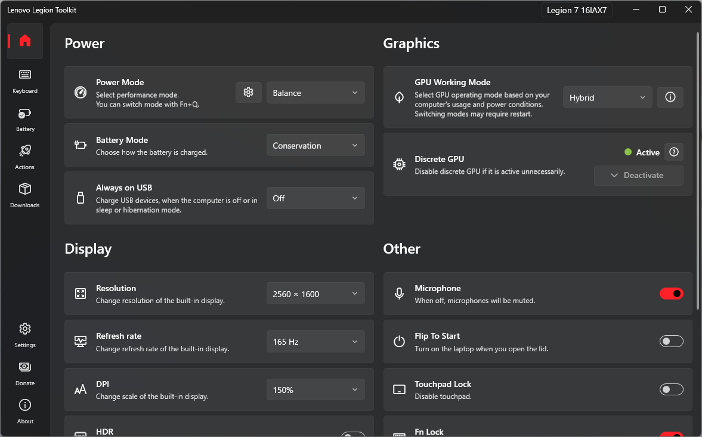

# Lenovo YOGA Toolkit
Modified from [LenovoYogaToolkit](https://github.com/BartoszCichecki/LenovoYogaToolkit/), added support for  YOGA Slim 7 Pro X 2022 (YOGA Pro 14s 2022) with following changes:
  - Fix keyboard backlight switching

# Table of Contents
  - [Disclaimer](#disclaimer)
  - [Download](#download)
  - [Compatibility](#compatibility)
  - [Features](#features)
  - [Donate](#donate)
  - [Credits](#credits)
  - [FAQ](#faq)
  - [How to collect logs?](#how-to-collect-logs)

## Download

You can download the installer from the [Releases page](https://github.com/BartoszCichecki/LenovoYogaToolkit/releases/latest) or install using [winget](https://github.com/microsoft/winget-cli):

`winget install BartoszCichecki.LenovoYogaToolkit`

#### Next steps

LLT works best when it's running in the background, so go to Settings and enable _Autorun_ and _Minimize on close_. Next thing is to either disable Vantage and Hotkeys or just uninstall them. After that LLT will always run on startup and will take over all functions that were handled by Vantage and Hotkeys.

If you close LLT completely some functions will not work, like synchronizing power plans with current Power Mode (Fn+Q) or Actions.

Also, check out the [Compatibility](#compatibility) section below!

## Features

The app allows to:

- Change settings like power mode, battery charging mode, etc. that are available only through Vantage.
- Access to Custom Mode available only in Legion Zone, including Fan Control on 2022 and newer models.
- Spectrum RGB and White backlight keyboards support.
- Change display refresh rate (built-in display only).
- Deactivate discrete GPU (nVidia only).
- View battery statistics.
- Download software updates.
- Define Actions that will run when the laptop is i.e. connected to AC power.
- Disable/enable Lenovo Vantage, Legion Zone and Lenovo Hotkeys service without uninstalling it.

##### Deactivate discrete GPU

Sometimes discrete GPU stays active even when it should not. This can happen for example, if you work with an external screen and you disconnect it - some processes will keep running on discrete GPU keeping it alive and shortening battery life.

There are two ways to help the GPU deactivate:

1. killing all processes running on dGPU (this one seems to work better),
2. disabling dGPU for a short amount of time, which will force all processes to move to the integrated GPU.

Deactivate button will be enabled when dGPU is active, you have Hybrid mode enabled and there are no screens connected to dGPU. If you hover over the button, you will see the current P state of dGPU and the list of processes running on it.

Keep in mind that some apps may not like this feature and crash when you deactivate dGPU.

##### Windows Power Plans

Lenovo Legion Toolkit will automatically switch Windows power plans when Power Mode changes *and* when Lenovo Vantage is disabled.

On some laptops though, Lenovo Vantage never switched power plans. If you have one of the laptops where Lenovo Vantage does not change Windows power plans automatically you can override this behavior in Settings. This will allow Toolkit to always change Windows power plans, even if Lenovo Vantage is running in the background.

Laptops that have S0 Low Power mode enabled, also known as Modern Standby, do not work well with mutliple power plans, especially with performance power plans.

## Credits

Special thanks to:

* [ViRb3](https://github.com/ViRb3), for creating [Lenovo Controller](https://github.com/ViRb3/LenovoController), which was used as a base for this tool
* [falahati](https://github.com/falahati), for creating [NvAPIWrapper](https://github.com/falahati/NvAPIWrapper) and [WindowsDisplayAPI](https://github.com/falahati/WindowsDisplayAPI)
* [SmokelessCPU](https://github.com/SmokelessCPU), for help with 4-zone RGB and Sprectrum keyboard support
* [Mario Bălănică](https://github.com/mariobalanica), for all contributions

## FAQ

#### My motherboard was replaced and now LLT gives me incompatible message. What do I do?

Sometimes new motherboard does not contain correct model numbers and serial numbers. You should try [this tutorial](https://laptopwiki.eu/laptopwiki/guides/lenovo/legion_bios_lvarrecovery) to try and recover them. If that method does not succeed, you can workaround by going to `%LOCALAPPDATA%\LenovoYogaToolkit` and creating an `args.txt` file. Inside that file paste `--skip-compat-check`. This will disable all compatibility checks in LLT. Use this workaround only if correct model number, serial number etc. can't be restored.

#### Why I can't switch to Performance or Custom Power Mode on battery?

Starting with version 2.11.0, LLT's behavior was aligned with Vantage and Legion Zone and it does not allow using them without an appropriate power source.

If for whatever reason you want to use these modes on battery anyway, you can use `--allow-all-power-modes-on-battery` argument. Note that Power Limits and other settings are not applied correctly on most devices when laptop is not connected to full power AC adapter and unpredictable and weird behavior is expected.

You have been warned, but here are the steps to allow all power modes without AC adapter:
1. Go to `%LOCALAPPDATA%\LenovoYogaToolkit`
2. Create `args.txt` file in there (if you already have it edit)
3. Paste `--allow-all-power-modes-on-battery`
4. Start LLT

#### Why is my Fn lock is flipped?

Some devices experience this issue and frankly, I have no idea why. It is known issue, but if you know how to solve it, check out the Contribution section.

#### Why is switching to Performance mode seems buggy, when AI Engine is enabled?

It seems that some BIOS versions indeed have a weird issue when using Fn+Q. Only hope is to wait for Lenovo to fix it.

#### Why isn't a game detected, even though Actions are configured properly?

Game detection feature is built on top of Windows' game detection, meaning LLT will react to EXE files that Windows considers "a game". That also means that if you nuked Xbox Game Bar from your installation, there is 99.9% chance this feature will not work.

Windows probably doesn't recognize all games properly, but you can mark any program as game in Xbox Game Bar settings (Win+G). You can find list of recognized games in registry: `HKEY_CURRENT_USER\System\GameConfigStore\Children`.

#### Why don't I see the custom tooltip when I hover LLT icon in tray?

In Windows 10 and 11, Microsoft did plenty of changes to the tray, breaking a lot of things on the way. As a results custom tooltips not always work properly. Solution? Update your Windows and keep fingers crossed.

#### Where can I find CPU Boost Mode settings?

Shortly speaking, in Windows Control Panel. This option was removed from LLT since it was quite annoying to maintain and it's available inside Windows Control Panel. In LLT's Settings you can find a link directly to the power plan setttings page in Control Panel where you can easily edit CPU Boost Mode settings as well as other settings of Windows power plans.

By default this setting is hidden, but can be revealed by running `powercfg.exe -attributes sub_processor perfboostmode -attrib_hide` in Terminal.

I also recommend other apps that make it very easy to manage settings across multiple power plans: [PowerSettingsExplorer](https://forums.guru3d.com/threads/windows-power-plan-settings-explorer-utility.416058/) and [QuickCPU](https://coderbag.com/product/quickcpu).

## How to collect logs?

In some cases it will be super useful if you can provide logs that this app can create. This helps with debugging and other issue solving.

To collect logs:

1. Make sure that Lenovo Legion Toolkit is not running (also gone from tray area).
2. Open `Run` (Win+R) and type there: `"%LOCALAPPDATA%\Programs\LenovoYogaToolkit\Lenovo Legion Toolkit.exe" --trace` and hit OK
3. LLT will start and in the title bar you should see: `[LOGGING ENABLED]`
4. Reproduce the issue you have (i.e. try to use the option that causes issues)
5. Close LLT (also make sure it's gone from tray area)
6. Again, in `Run` (Win+R) type `"%LOCALAPPDATA%\LenovoYogaToolkit\log"`
7. You should see at least one file. Theses are the logs you should attach to the issue.

